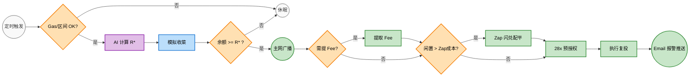
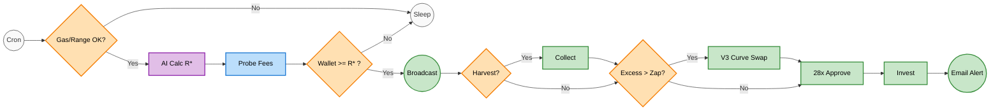

# 自动化 Uniswap V3 (Arbitrum) 资金池复投

---

# 🇨🇳 中文版 (Chinese Version)

# 🚀 Uniswap V3 通用型全自动复投机器人 (Arbitrum)

这是一个专为 Uniswap V3 集中流动性设计的通用型全自动复投机器人。它以极低的 Gas 成本运行在 Arbitrum L2 网络上，能够 7x24 小时监控你的流动性仓位（LP NFT）。当手续费收益达到设定阈值时，它会自动提取收益并按比例重新注入资金池，实现真正的**被动复利增长（Auto-Compounding）**。

本仓库采用极简策略，仅包含核心的智能合约逻辑（`Compound.s.sol`）、外层执行流水线（`run_compound.sh`）以及纯净的通讯预警雷达（`email_monitor.sh`），拒绝冗余文件，确保安全透明。

### 💡 核心特性与安全机制

1. **支持任意代币池**：无需配置外部预言机，通过内部纯链上计价雷达，完美支持任意币对（如 WETH/USDC, WBTC/WETH）。
2. **AI 动态最优门限 ()**：摒弃魔法数字，系统会根据实时 BaseFee、Swap 磨损及池子总本金，运用微积分方程实时算出收益最大化的复投触发门限。
3. **V3 动态曲率 Zap 引擎**：当探测到单边资金闲置（Excess）且达到盈亏平衡点（Break-Even ）时，自动拉取当前 Tick 的精确非对称曲率，执行精准的 Swap 闪兑旁路，彻底消灭资金淤积。
4. **零损耗三段式解耦 (Decoupled Pipeline)**：分为收菜 (Module A)、复投 (Module B)、闪兑 (Module C) 三大独立状态机。即使收益未达标，只要外部注资充足，也能丝滑触发复投，且**条件不足时主动休眠，绝对不消耗真实 Gas**。
5. **最小权限缓存授权 (PoLP Cache)**：将代币和 Router 的授权（Approve）额度严格限制为单次所需的 28 倍。既能节省后续 90%+ 的授权 Gas 费，又将资金的安全敞口降至最低。
6. **零依赖 Bash 邮件雷达 (Zero-Dependency Email Radar)**：原生采用 `curl` 直连底层 SMTP 协议（完美适配网易 163 的 465 隐式 SSL 端口等）。在仓位脱轨或复投成功时，实时将精美 HTML 战报推送至手机，无需安装任何 Python 依赖。



---

## 🛠️ 安装与部署指南

### 第一步：安装 Foundry 环境

本程序依赖 Foundry 框架。请在 Linux（推荐 Ubuntu）或 macOS 服务器终端中执行：

```
curl -L https://foundry.paradigm.xyz | bash
source ~/.bashrc  # 或 ~/.zshrc
foundryup

```

### 第二步：初始化项目与下载脚本

由于本仓库仅提供核心脚本，你需要先初始化一个空的 Foundry 项目环境：

```
# 1. 初始化标准 Foundry 项目
forge init uniswap-bot
cd uniswap-bot

# 2. 将本仓库的代码放入对应目录
# （把 Compound.s.sol 覆盖到 script/ 目录下）
# （把 run_compound.sh 和 email_monitor.sh 放在根目录下）
mv 你的下载路径/Compound.s.sol script/
mv 你的下载路径/run_compound.sh ./
mv 你的下载路径/email_monitor.sh ./

```

### 第三步：准备专用的自动化钱包

⚠️ **安全警告：绝对不要将存放主资金的个人钱包私钥放在联网服务器上！**

1. 创建一个**全新**的独立钱包地址，专用于该机器人。
2. 转入你要组建流动性的代币（如 WETH 和 USDC），以及少量原生 ETH（约 5-10 美元等值即可，用作长期的 Gas 燃料）。
3. 使用该钱包在 Uniswap 手动建立一次流动性，并记录下 **NFT ID**。

### 第四步：加密配置本地私钥 (Keystore)

请勿使用明文私钥。运行以下命令将私钥安全加密：

```
cast wallet import bot_account --interactive

```

* 粘贴机器人钱包的私钥（不可见，直接回车）。
* 设置一个本地加密密码。

创建一个拥有严格权限的隐藏文件来存放该密码，供后台脚本读取：

```
nano .pass
# 输入你刚才设置的密码，按 Ctrl+O 保存，回车确认，Ctrl+X 退出
chmod 600 .pass # 确保仅当前用户可读

```

### 第五步：配置调度与邮件雷达脚本

编辑主流水线脚本，输入你的仓位信息：

```
nano run_compound.sh

```

修改以下核心参数：

```
# 你的 Uniswap V3 Position NFT ID
export TOKEN_ID=1234567

# 设定“本位币”索引（0 代表 Token0，1 代表 Token1）
export BASE_TOKEN_INDEX=1

# 设定复投阈值 (采用万分位 X10000 标定法)
# 设为 0 即激活 AI 动态算力引擎，自动寻找最优盈亏平衡点！
export TARGET_MIN_BASE_AMOUNT_X10000=0

# 开启纯数学 Zap 闪兑旁路，极限压榨资金利用率
export ALLOW_AUTO_ZAP="true"

```

接着，配置你的邮件报警雷达（以 163 邮箱为例）：

```
nano email_monitor.sh
# 填入你的发件箱、应用专有授权码、以及接收报警的邮箱

```

保存并赋予两个脚本执行权限：

```
chmod +x run_compound.sh email_monitor.sh

```

### 第六步：测试与后台守护 (Crontab)

使用带邮件雷达的完整外壳，手动运行一次测试环境：

```
./email_monitor.sh ./run_compound.sh

```

如果屏幕上打印出 `[!] SKIP: Conditions not met for any action.` 且未发生报错，说明系统测试完美通过！如果有真实的复投或仓位脱轨，你的邮箱将立刻收到推送。

**设置后台定时任务 (Crontab)：**
让机器人在后台每 4 小时自动醒来执行，并记录双路日志：

```bash
crontab -e

```

在底部添加以下内容。
*(💡 防拥堵小贴士：强烈建议把开头的分钟数设定为 `0-59` 之间的任意幸运数字，而不要用 `0`。这能打散请求，防止所有人的机器人在整点同时向 RPC 节点发起轰炸而导致 IP 被限流。)*

```text
# 每天每 4 小时运行一次（例如 00:14, 04:14 触发）
# 2>&1 机制确保底层的崩溃报错也能被精准捕获进 master 日志中
14 */4 * * * /你的实际路径/uniswap-bot/email_monitor.sh /你的实际路径/uniswap-bot/run_compound.sh >> /你的实际路径/uniswap-bot/cron_master.log 2>&1

```

---

## ⚠️ 免责声明

本项目代码开源仅供学习和技术交流使用。DeFi 领域存在诸多不可预知的智能合约风险，请务必在充分理解代码逻辑并在测试环境跑通后，再考虑投入真实资金。开发者不对任何人因使用本代码造成的资金损失负责。

---

# English Version

# 🚀 Universal Auto-Compound Bot for Uniswap V3 (Arbitrum)

A lightweight, highly secure, and universal auto-compounding bot for Uniswap V3 concentrated liquidity positions. Designed to run on Arbitrum L2 (or any low-cost EVM L2), it monitors your LP NFT 24/7. Once the uncollected fees reach your target threshold, it automatically collects and reinvests them into your position, unlocking the power of compound interest.

This repository takes a minimalist approach. It contains only the core smart contract logic (`Compound.s.sol`), the execution pipeline (`run_compound.sh`), and a clean telemetry radar (`email_monitor.sh`).

### 💡 Key Features & Security Mechanisms

1. **Universal Token Support**: Works with ANY token pair (e.g., WETH/USDC) via purely on-chain telemetry. No external oracles required.
2. **AI Dynamic Optimal Threshold ( )**: Eliminates magic numbers. Calculates the mathematically perfect reinvestment threshold in real-time based on baseFee, swap friction, and your principal size.
3. **V3 Dynamic Curve Zap Engine**: Detects idle excess capital and triggers a precision swap bypass based on the exact asymmetrical curve of the current Tick, ensuring zero capital stagnation.
4. **Decoupled 3-Stage Pipeline**: Separates Collect (Mod A), Reinvest (Mod B), and Zap (Mod C) into distinct state machines. It safely sleeps when math dictates it's unprofitable, **burning absolutely zero gas**.
5. **PoLP Allowance Caching**: Caches approvals at exactly 28x the required amounts for both Position Manager and Swap Router. Saves >90% on future gas costs while strictly limiting the smart contract blast radius.
6. **Zero-Dependency Bash Email Radar**: Built with pure Bash + `curl` to interface directly with SMTP protocols (e.g., port 465 SSL). Delivers beautiful HTML telemetry reports to your phone upon successful reinvestment or position out-of-range, eliminating the need for bulky Python environments.



---

## 🛠️ Installation & Setup Guide

### Step 1: Install Foundry

This bot is powered by Foundry. Install it on your Linux (recommended) or macOS server:

```
curl -L https://foundry.paradigm.xyz | bash
source ~/.bashrc  # or ~/.zshrc
foundryup

```

### Step 2: Initialize Project & Download Scripts

Since this repo only provides the raw scripts, initialize an empty Foundry project and replace the default scripts:

```
# 1. Initialize a new Foundry project
forge init uniswap-bot
cd uniswap-bot

# 2. Download the core scripts from this repository
# (Place Compound.s.sol into the script/ folder)
# (Place run_compound.sh and email_monitor.sh into the root folder)
mv path/to/downloaded/Compound.s.sol script/
mv path/to/downloaded/run_compound.sh ./
mv path/to/downloaded/email_monitor.sh ./

```

### Step 3: Prepare a Dedicated Bot Wallet

⚠️ **SECURITY WARNING: NEVER use your main wallet holding significant funds.**

1. Create a brand new Ethereum address exclusively for this bot.
2. Transfer the tokens you want to LP (e.g., WETH and USDC) and a few dollars of native ETH (for Gas) into this new wallet.
3. Manually create your Uniswap V3 position using this wallet and note down the **NFT ID**.

### Step 4: Secure Keystore Configuration

Never store plain-text private keys. Use Foundry's keystore to encrypt it:

```
cast wallet import bot_account --interactive

```

* Paste your bot wallet's private key (it will be hidden).
* Set a local encryption password.

Create a strict-permission file to store this password so the cronjob can read it:

```
nano .pass
# Type your password, save (Ctrl+O, Enter) and exit (Ctrl+X)
chmod 600 .pass # Ensure only your user can read this file

```

### Step 5: Configure the Pipeline Script

Edit `run_compound.sh` to match your position:

```
nano run_compound.sh

```

Update these crucial variables:

```
export TOKEN_ID=1234567
export BASE_TOKEN_INDEX=1

# Set to 0 to unleash the AI Dynamic Threshold engine
export TARGET_MIN_BASE_AMOUNT_X10000=0

# Enable the Pure Math Zap Engine for max capital efficiency
export ALLOW_AUTO_ZAP="true"

```

Next, configure your email radar:

```
nano email_monitor.sh
# Fill in your SMTP server, sender email, app password, and receiver email

```

Make both scripts executable:

```
chmod +x run_compound.sh email_monitor.sh

```

### Step 6: Test and Automate

Run the full wrapper script manually to ensure everything is configured correctly:

```
./email_monitor.sh ./run_compound.sh

```

If your fees are below the threshold, you should see a `[!] SKIP` message—this means the protection is working perfectly! You'll receive an email notification whenever a real compound action or error occurs.

**Automate via Crontab:**
Set the bot to run every 4 hours automatically with comprehensive error logging:

```bash
crontab -e

```

Add the following line at the bottom.
*(💡 Pro Tip: Pick a random minute between `0-59` instead of `0` to prevent the "thundering herd" problem. This ensures not everyone is hitting the public RPC node exactly at the top of the hour, which could lead to IP rate-limiting.)*

```text
# Runs at 14 minutes past the hour, every 4 hours (e.g., 00:14, 04:14)
# The 2>&1 ensures even OS-level faults are captured in the master log
14 */4 * * * /path/to/your/uniswap-bot/email_monitor.sh /path/to/your/uniswap-bot/run_compound.sh >> /path/to/your/uniswap-bot/cron_master.log 2>&1

```

---

## ⚠️ Disclaimer

This code is provided for educational and technical exploration purposes only. DeFi and smart contracts carry inherent risks. Please review the code thoroughly and test it with a small amount of funds before deploying. The creator is not responsible for any financial losses incurred.

* * *
