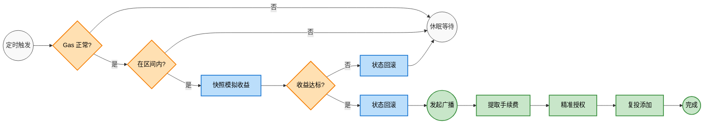
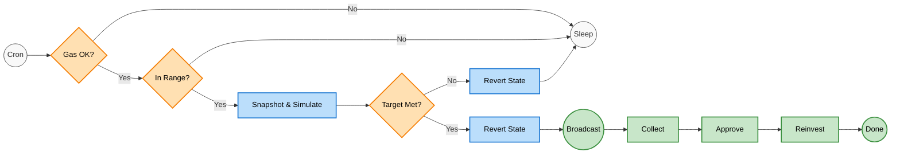

#  自动化 Uniswap V3 (Arbitrum) 资金池复投 

* * *

🇨🇳 中文版 (Chinese Version)
==========================

🚀 Uniswap V3 通用型全自动复投机器人 (Arbitrum)
====================================

这是一个专为 Uniswap V3 集中流动性设计的通用型全自动复投机器人。它以极低的 Gas 成本运行在 Arbitrum L2 网络上，能够 7x24 小时监控你的流动性仓位（LP NFT）。当手续费收益达到设定阈值时，它会自动提取收益并按比例重新注入资金池，实现真正的**被动复利增长（Auto-Compounding）**。

本仓库采用极简策略，仅包含核心的智能合约逻辑（`Compound.s.sol`）和外层执行流水线（`run_compound.sh`），拒绝冗余文件，确保安全透明。

💡 核心特性与安全机制
------------

1.  **支持任意代币池**：无需配置外部预言机，完美支持任意币对（如 WETH/USDC, WBTC/WETH）。
2.  **零损耗无痕探测 (Snapshot & Rollback)**：利用 Foundry 的 EVM 快照机制，在虚拟环境中模拟收取手续费。若收益未达标，立即回滚内存，**绝对不会产生真实的链上交易和 Gas 消耗**。
3.  **网络拥堵保护 (Gas Throttling)**：实时监测 Arbitrum 的 `baseFee`，若网络拥堵则主动休眠，防止收益全交了过路费。
4.  **越界保护 (Out-of-Range)**：若当前价格脱离你设定的流动性区间，系统将暂停复投。
5.  **最小权限授权 (PoLP)**：将代币的授权（Approve）额度严格限制为单次所需的 28 倍。既能节省后续 90%+ 的授权 Gas 费，又将资金的安全敞口降至最低。

* * *

🛠️ 安装与部署指南
-----------

### 第一步：安装 Foundry 环境

本程序依赖 Foundry 框架。请在 Linux（推荐 Ubuntu）或 macOS 服务器终端中执行：

```
curl -L https://foundry.paradigm.xyz | bash
source ~/.bashrc  # 或 ~/.zshrc
foundryup
```

### 第二步：初始化项目与下载脚本

由于本仓库仅提供核心脚本，你需要先初始化一个空的 Foundry 项目环境：

```
# 1. 初始化标准 Foundry 项目
forge init uniswap-bot
cd uniswap-bot

# 2. 将本仓库的代码放入对应目录
# （把 Compound.s.sol 覆盖到 script/ 目录下）
# （把 run_compound.sh 放在根目录下）
mv 你的下载路径/Compound.s.sol script/
mv 你的下载路径/run_compound.sh ./
```

### 第三步：准备专用的自动化钱包

⚠️ **安全警告：绝对不要将存放主资金的个人钱包私钥放在联网服务器上！**

1.  创建一个**全新**的独立钱包地址，专用于该机器人。
2.  转入你要组建流动性的代币（如 WETH 和 USDC），以及少量原生 ETH（约 5-10 美元等值即可，用作长期的 Gas 燃料）。
3.  使用该钱包在 Uniswap 手动建立一次流动性，并记录下 **NFT ID**。

### 第四步：加密配置本地私钥 (Keystore)

请勿使用明文私钥。运行以下命令将私钥安全加密：

```
cast wallet import bot_account --interactive
```

*   粘贴机器人钱包的私钥（不可见，直接回车）。
*   设置一个本地加密密码。

创建一个拥有严格权限的隐藏文件来存放该密码，供后台脚本读取：

```
nano .pass
# 输入你刚才设置的密码，按 Ctrl+O 保存，回车确认，Ctrl+X 退出
chmod 600 .pass # 确保仅当前用户可读
```

### 第五步：配置调度脚本参数

编辑流水线脚本，输入你的仓位信息：

```
nano run_compound.sh
```

修改以下核心参数：

```
# 务必修改为当前项目所在的绝对路径
WORK_DIR="/你的实际路径/uniswap-bot"

# 你的 Uniswap V3 Position NFT ID
export TOKEN_ID=1234567

# 设定“本位币”索引（0 代表 Token0，1 代表 Token1）
# 提示：在 WETH/USDC 池子中，USDC 通常是 Token1，因此设为 1
export BASE_TOKEN_INDEX=1

# 设定复投阈值 (采用万分位 X10000 标定法)
# 如果本位币是 USDC，20000 代表 2.0000 USDC 收益时触发复投
export TARGET_MIN_BASE_AMOUNT_X10000=20000
```

保存并赋予执行权限：

```
chmod +x run_compound.sh
```

### 第六步：测试与后台守护 (Crontab)

手动运行一次测试环境配置：

```
./run_compound.sh
cat compound_bot.log
```

如果因为收益不足而显示 `[!] SKIP` 并伴随 `Warning: No transactions to broadcast.`，说明系统测试完美通过！

**设置后台定时任务 (Crontab)：**
让机器人在后台每 4 小时自动醒来执行：
```bash
crontab -e
```
在底部添加以下内容。
*(💡 防拥堵小贴士：强烈建议把开头的分钟数设定为 `0-59` 之间的任意幸运数字，而不要用 `0`。这能打散请求，防止所有人的机器人在整点同时向 RPC 节点发起轰炸而导致 IP 被限流。)*
```text
# 每天每 4 小时运行一次（例如 00:14, 04:14 触发）
14 */4 * * * /你的实际路径/uniswap-bot/run_compound.sh
```

* * *

⚠️ 免责声明
-------

本项目代码开源仅供学习和技术交流使用。DeFi 领域存在诸多不可预知的智能合约风险，请务必在充分理解代码逻辑并在测试环境跑通后，再考虑投入真实资金。开发者不对任何人因使用本代码造成的资金损失负责。


* * *

🇬🇧 English Version
====================

🚀 Universal Auto-Compound Bot for Uniswap V3 (Arbitrum)
========================================================

A lightweight, highly secure, and universal auto-compounding bot for Uniswap V3 concentrated liquidity positions. Designed to run on Arbitrum L2 (or any low-cost EVM L2), it monitors your LP NFT 24/7. Once the uncollected fees reach your target threshold, it automatically collects and reinvests them into your position, unlocking the power of compound interest.

This repository takes a minimalist approach. It contains only the core smart contract logic (`Compound.s.sol`) and the execution pipeline (`run_compound.sh`).

💡 Key Features & Security Mechanisms
-------------------------------------

1.  **Universal Token Support**: Works with ANY token pair (e.g., WETH/USDC, WBTC/WETH). No hardcoded price oracles are required.
2.  **Zero-Waste Snapshot Probing**: Uses Foundry's EVM snapshot & rollback features. It simulates the fee collection locally; if the target threshold isn't met, it reverts the state and gracefully exits **without broadcasting any transaction or burning Gas**.
3.  **Gas Throttling**: Monitors network `baseFee`. If Arbitrum is congested, the bot goes to sleep to protect your yields from high gas fees.
4.  **Out-of-Range Protection**: Halts reinvestment if the current price is outside your LP bounds.
5.  **Least Privilege Allowance (PoLP)**: Approves exactly 28x of the required token amounts. This minimizes future `approve` gas costs while strictly limiting the blast radius of the smart contract approval.

* * *

🛠️ Installation & Setup Guide
------------------------------

### Step 1: Install Foundry

This bot is powered by Foundry. Install it on your Linux (recommended) or macOS server:

```
curl -L https://foundry.paradigm.xyz | bash
source ~/.bashrc  # or ~/.zshrc
foundryup
```

### Step 2: Initialize Project & Download Scripts

Since this repo only provides the raw scripts, initialize an empty Foundry project and replace the default scripts:

```
# 1. Initialize a new Foundry project
forge init uniswap-bot
cd uniswap-bot

# 2. Download the core scripts from this repository
# (Place Compound.s.sol into the script/ folder)
# (Place run_compound.sh into the root folder)
mv path/to/downloaded/Compound.s.sol script/
mv path/to/downloaded/run_compound.sh ./
```

### Step 3: Prepare a Dedicated Bot Wallet

⚠️ **SECURITY WARNING: NEVER use your main wallet holding significant funds.**

1.  Create a brand new Ethereum address exclusively for this bot.
2.  Transfer the tokens you want to LP (e.g., WETH and USDC) and a few dollars of native ETH (for Gas) into this new wallet.
3.  Manually create your Uniswap V3 position using this wallet and note down the **NFT ID**.

### Step 4: Secure Keystore Configuration

Never store plain-text private keys. Use Foundry's keystore to encrypt it:

```
cast wallet import bot_account --interactive
```

*   Paste your bot wallet's private key (it will be hidden).
*   Set a local encryption password.

Create a strict-permission file to store this password so the cronjob can read it:

```
nano .pass
# Type your password, save (Ctrl+O, Enter) and exit (Ctrl+X)
chmod 600 .pass # Ensure only your user can read this file
```

### Step 5: Configure the Pipeline Script

Edit `run_compound.sh` to match your position:

```
nano run_compound.sh
```

Update these crucial variables:

```
# Ensure WORK_DIR points to your actual absolute path
WORK_DIR="/path/to/your/uniswap-bot"

# Your Uniswap V3 Position NFT ID
export TOKEN_ID=1234567

# Base Token Index (0 for Token0, 1 for Token1)
# e.g., in a WETH/USDC pool, USDC is usually Token1, so set to 1.
export BASE_TOKEN_INDEX=1

# Target Threshold (Using X10000 multiplier for decimals)
# e.g., If Base is USDC, 20000 means triggering at 2.0000 USDC
export TARGET_MIN_BASE_AMOUNT_X10000=20000
```

Make the script executable:

```
chmod +x run_compound.sh
```

### Step 6: Test and Automate

Run the script manually to ensure everything is configured correctly:

```
./run_compound.sh
cat compound_bot.log
```

If your fees are below the threshold, you should see a `[!] SKIP` message and `Warning: No transactions to broadcast.`—this means the protection is working perfectly!

**Automate via Crontab:**
Set the bot to run every 4 hours automatically:
```bash
crontab -e
```
Add the following line at the bottom. 
*(💡 Pro Tip: Pick a random minute between `0-59` instead of `0` to prevent the "thundering herd" problem. This ensures not everyone is hitting the public RPC node exactly at the top of the hour, which could lead to IP rate-limiting.)*
```text
# Runs at 14 minutes past the hour, every 4 hours (e.g., 00:14, 04:14)
14 */4 * * * /path/to/your/uniswap-bot/run_compound.sh
```

* * *

⚠️ Disclaimer
-------------

This code is provided for educational and technical exploration purposes only. DeFi and smart contracts carry inherent risks. Please review the code thoroughly and test it with a small amount of funds before deploying. The creator is not responsible for any financial losses incurred.

* * *


---
Powered by [Gemini Exporter](https://www.ai-chat-exporter.com)
