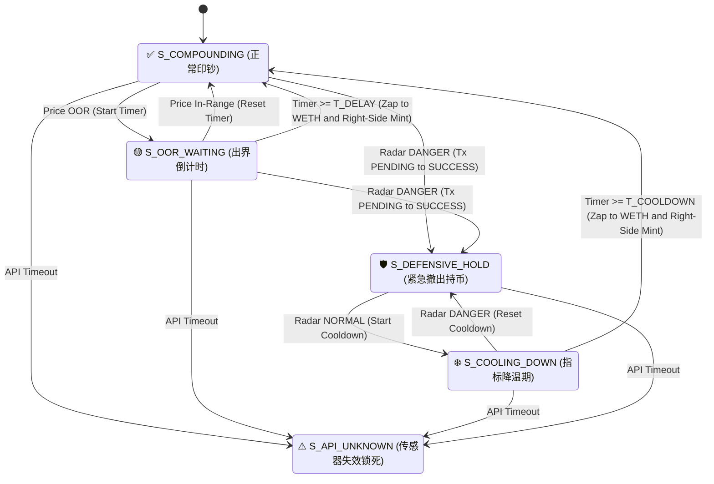

🛡️ Uniswap V3 自动化右侧投资策略 (UniSwapV3 Right Side Strategy)
========================================================

> **架构声明**：本系统基于 **TLA+ 形式化验证** 构建。
> 策略细节参见 TLA+描述文件: UniSwapV3RightSideStrategy.tla

**策略概述**：本系统是一套针对 Uniswap V3 设计的自动化流动性管理方案，核心逻辑在于通过动态风险评估与“绝对右侧”建仓算法，在捕捉 ETH 震荡收益的同时，实现极端行情下的资产保全。

一、 策略核心逻辑描述 (Quant Strategy Overview)
-------------------------------------

本策略通过高度模块化的逻辑，实现对链上头寸的全生命周期管理，其核心运行机制如下：

### 1\. 动态风险调节机制 (Risk-Adjusted Management)

*   **✅ 复合收益模式 (Compounding Mode)**
    *   **核心行为**：当市场价格处于预设的流动性区间（Tick Range）内时，系统执行自动化复投逻辑，将手续费收益实时注入头寸，最大化资金利用率。
*   **🟡 震荡容忍与自愈 (Volatility Buffer)**
    *   **核心行为**：当价格发生瞬时偏离（出界）时，系统并不立即触发强制平仓。
    *   **技术实现**：引入“时间窗口延迟”机制，过滤高频随机噪声。若价格在预设窗口内回归，系统自动识别为“假突破”并恢复运行，有效降低了因频繁调仓导致的滑点损耗。
*   **🛡️ 应急撤离与防御 (Emergency Liquidation)**
    *   **行为逻辑**：当外部风险指标（雷达预警）触发时，系统优先确保资产安全。
    *   **链上确认锁**：采用“双重状态确认”机制。系统在发送撤离指令后，必须获得链上结算成功的确定性回执，才会确认为防御姿态（100% 现货），杜绝了网络拥堵期间的逻辑冲突。
*   **❄️ 趋势观察期 (Cool-off Period)**
    *   **行为逻辑**：风险警报解除后，系统强制进入观察期，防止因行情反复波动（扫损）造成的连续调仓。

### 2\. 绝对右侧重平衡算法 (Absolute Right-Side Zap)

这是本策略的核心盈利与效率引擎：

*   **金融逻辑**：系统坚持“右侧建仓”哲学。无论行情如何演变，新建立的流动性区间下限永远高于当前市场价格 ( $LowerTick>CurrentPrice$ )。
*   **资金流优化 (Zap Module)**：由于右侧区间在建立初期仅需单边资产（WETH），智能合约会自动将头寸中所有的稳定币（USDC）全额兑换为 WETH。
*   **优势总结**：
    *   **零灰尘残留**：彻底消除了传统双币配比计算中的精度误差和冗余资金残留。
    *   **备兑收益**：通过满仓 WETH 挂单，系统本质上是在获取 ETH 潜在涨幅的同时，额外赚取高额的期权权利金（手续费）。

### 3\. 故障熔断机制 (Fail-safe Halt)

*   **人工介入模式**：当预言机或底层 API 数据源出现异常（断联、延迟或逻辑错误）时，系统将立即触发“原子级停机”。
*   **核心保护**：此时所有自动化划转功能将锁定，强制要求管理员通过多签钱包进行人工介入排查，确保在“极端盲区”下资产不被误操作。

二、 状态机流转图
------------------------

